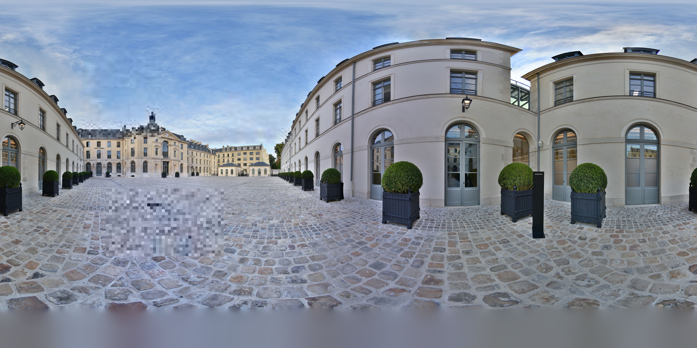

# sharp-vs-jimp-pixelate-image

Because `jimp` depends on `jpeg-js`, and `jpeg-js` takes up a lot of memory when decoding.

Necessary to protect against memory attacks, `jpeg-js` [breaking change](https://github.com/jpeg-js/jpeg-js/pull/68) on 0.4.0.

But in fact, the problem of memory consumption still exists. This threshold is to avoid memory attacks.

## Pixelated image comparison

#### jimp

#### sharp

